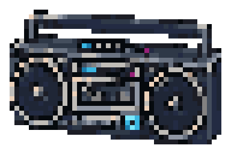
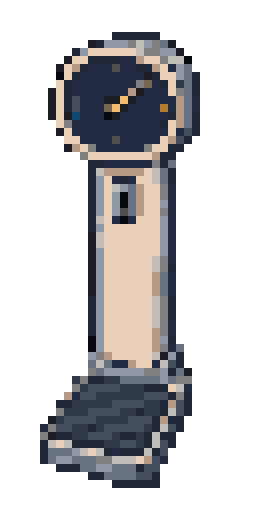

# DEAD MALL boombox and weighing scale

Two selected transparent pixel-art props archived on 2026-10-07. Both use the
`dead-mall-current-props-20260930` profile and are standalone raster candidates;
this is archived art, not wired into gameplay.

## Portable boombox — 48×32

[Native PNG](boombox.png) · [8× preview](previews/boombox@8x.png) · Pixel Forge
library item `20261007-223024-boombox-with-2px-transparent-padding-12c4`.

## Coin-operated weighing scale — 32×64

[Native PNG](weighing-scale.png) · [8× preview](previews/weighing-scale@8x.png) · Pixel Forge
library item `20261007-222712-one-vintage-coin-operated-mall-weighing--c293`.

Both native images contain 18 opaque colors and binary transparency. Pixel Forge
lint scored each 100, with non-blocking notes about selective outlines and
near-duplicate colors; the scale also has a straight color-boundary note. The
boombox's original prepare QA reported 138 isolated single pixels before the
16-pixel padding correction; the unchanged scale prepare QA reported 68. These
are texture metrics, not a claim that every counted pixel is a stray. See
[manifest.json](manifest.json) for exact hashes,
dimensions, provenance and measurements. These checks do not establish
gameplay readiness.
