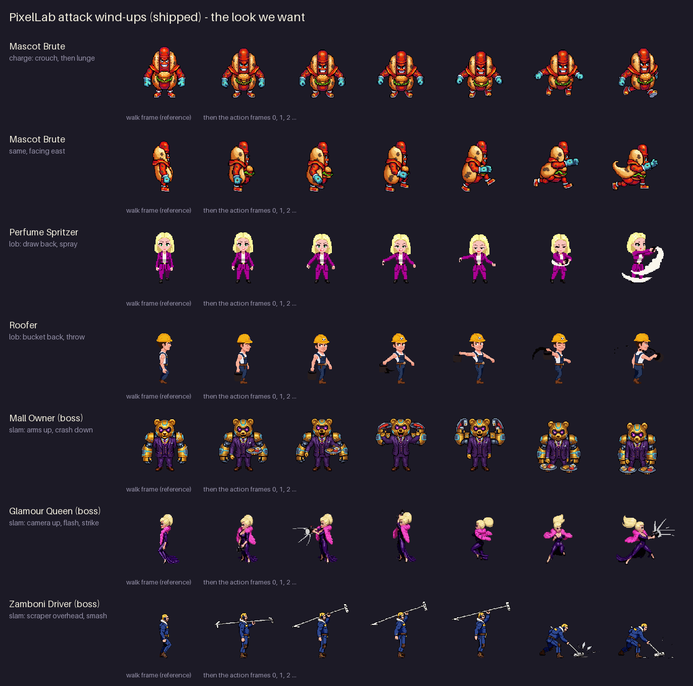
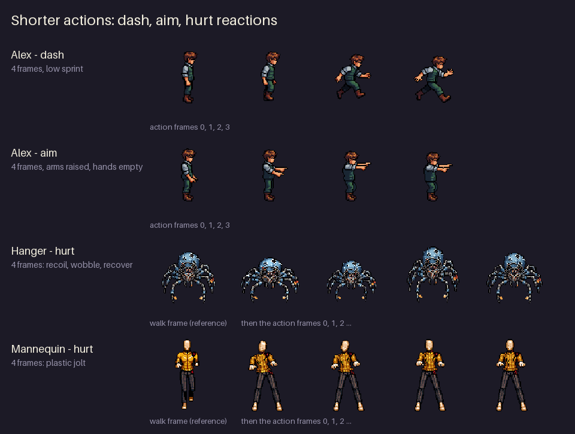
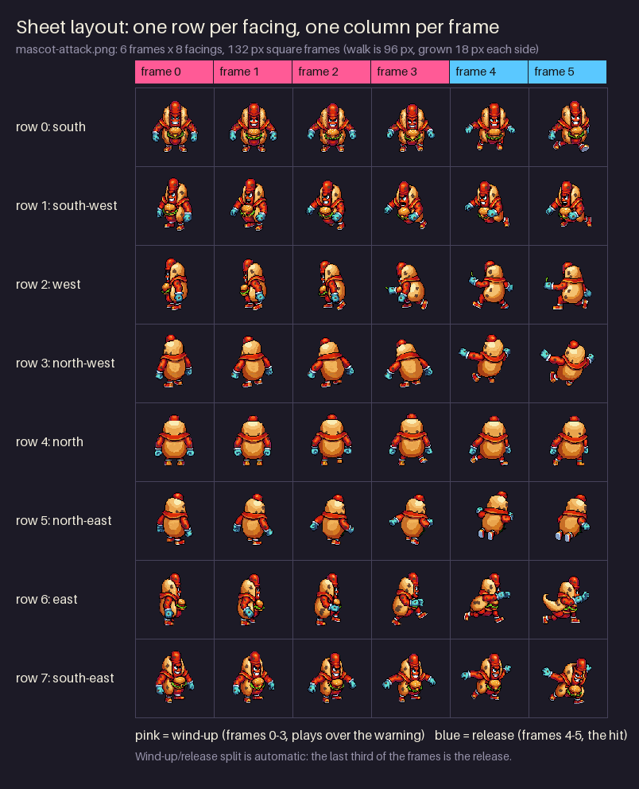
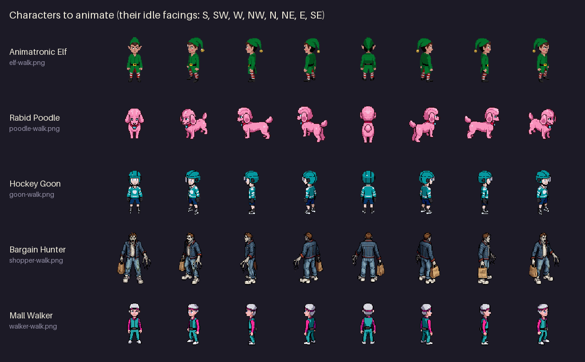

# Animation handoff: sprite sheets still needed

This is for an agent with image generation (GPT, "dot") picking up DEAD MALL's
character animation work. It says exactly what to draw, shows animations that
already shipped, and explains how to check and install a sheet. Read `AGENTS.md`
first (the repo rules), then this file.

**Tools:** use whatever makes the best pixel art. Options include your own image
generation, PixelLab (pixellab.ai), and **Pixel Forge**, which authored the game's
weapon effects (see `public/assets/neon/manifest.json`). You can also generate a
pose and clean it up by hand. What counts is the result: it must look like the
character in its walk sheet, in the same pixel-art style, and pass
`art/pixellab/check_sheet.py`.

---

## 1. What the shipped animations look like

PixelLab animated the game's own characters, so look at these first. Each row
below starts with the character's walk frame, then the action frames in order.



Shorter actions (4 frames): Alex's dash and aim, and the hurt reactions.



What makes these work:
- **The same character in every frame and facing.** Same outfit, colours,
  proportions and props (the Mascot's bun, the Roofer's bucket). Avoid any drift:
  no new weapons, no costume changes, no colour swaps between facings.
- **The pose reads from across the room.** The wind-up is big and slow (crouch,
  draw back, raise overhead) and the release is a clear snap (lunge, throw, slam).
  The player has to recognise the attack coming from the silhouette alone.
- **Feet stay planted** in the wind-up frames, so the figure doesn't slide. The
  release may step or lunge forward.
- **Matching pixel art.** Crisp 1-px dark outline, the same shading style, no
  blur, no anti-aliased halo, no soft gradients. Transparent background, no
  ground shadow (the game draws its own).
- **Effects are optional and small.** A puff, a flash or an impact line is fine
  in the release frames. Keep it inside the frame.

## 2. The sheet format (follow it exactly)



- **One PNG per action**, RGBA with a transparent background.
- **8 rows, one per facing, in this order:** south, south-west, west,
  north-west, north, north-east, east, south-east. South faces the camera, and
  north is the character's back.
- **One column per frame.** Frames are square and touch each other, with no
  padding or gutters.
- **Frame size:** the character's walk frame size, or larger by the same amount
  on every side (an even number of pixels in total). For example, the 96 px walk
  frame grows to a 132 px attack frame. Grow the frame when an arm or prop reaches
  outside the walk frame.
- **Scale:** draw the figure at **the same pixel size as the walk sheet**. Don't
  draw it bigger or smaller. If it comes out a different size, the checker warns,
  and `ACTION_FIGURE_SCALE` in `src/game/view/ActorSpriteView.ts` can correct it,
  but drawing it right is better.
- **Placement:** in the first frame, the feet should sit where the walk sheet's
  feet sit, centred the same way. `check_sheet.py --fix` lines this up
  automatically.
- **Facings:** you may draw 5 facings (south, south-west, west, north-west, north)
  and mirror west→east, south-west→south-east and north-west→north-east. Only do
  this when the character is left-right symmetric. Don't mirror someone holding
  something in one hand (the Bargain Hunter's shopping bag, the Goon's stick).
- **Palette:** use only the colours already in the character's walk sheet where
  you can. Quantise generated art to that palette: in PIL, `Image.quantize` with a
  palette image built from the walk sheet's colours.

**Attack timing is automatic.** The game splits the frames itself: the first
two-thirds are the **wind-up** (they play across the attack warning) and the last
third is the **release** (the hit). A 6-frame sheet is 4 wind-up frames plus 2
release frames.

## 3. What is still needed



The walk and idle sheets are in `public/assets/neon/enemies/`. Every character's
walk frame is 92 px, except the Bargain Hunter's, which is 96 px.

### Job A: attack wind-ups (highest value; the code is already wired)

The game already looks for these files. Each one only needs drawing, checking
and registering (section 4).

| File to make | Character | Frames | The action (what the game does) |
|---|---|---|---|
| `shopper-attack.png` | Bargain Hunter (walk 96 px) | 6 | **Charge.** Plants feet, hunches, swings the shopping bag back, glares (frames 0–3). Then barrels forward shoulder-first (frames 4–5). Telegraph 34 ticks (about 0.6 s). |
| `poodle-attack.png` | Rabid Poodle (92) | 6 | **Charge.** A short crouch: hackles up, haunches down, snarling (0–3). Then springs forward in a dash (4–5). Telegraph only 16 ticks, so the crouch must read at a glance. |
| `elf-attack.png` | Animatronic Elf (92) | 6 | **Leap and stomp.** Crouches, then springs into the air, tucks, and lands with a stomp. 0–3: crouch to spring; 4: airborne; 5: landing stomp. The game moves the sprite, so draw it in place. |
| `goon-attack.png` | Hockey Goon (92) | 6 | **Slap shot.** Winds the hockey stick back high over the shoulder (0–3), then swings through and fires the puck (4–5). Telegraph 30 ticks. After installing it, check in game that frames 4–5 show; `attackFrameFor` in `src/game/view/combatBeats.ts` may need a recover branch for the Goon. |

Optional: `static-attack.png` (the Static's teleport "blink"). The game does not
map blink wind-ups to frames yet, so it needs a small code change in
`attackFrameFor` first. Leave it unless asked.

### Job B: hurt reactions (roadmap V1)

These are 4 frames at the walk frame size: recoil from the hit, wobble, and
recover to the rest pose. Only the Hanger, Mannequin and Static have one so far.
Each kind also needs a 6-frame × 48 px **impact strip** in its own material
(foam stuffing for the Mascot, tar flecks for the Roofer, glitter for the Elf, and
so on), plus a little code. Follow the step-by-step recipe in
`docs/VISUAL_ROADMAP.md` under **V1**, and copy `tests/unit/hanger-reactions.test.ts`.

In order: Bargain Hunter (`shopper-hurt.png`), Mall Walker (`walker-hurt.png`),
Mascot, Roofer, Elf, Spritzer, Poodle, Goon, then the bosses (shorter flinches).

## 4. How to check and install a sheet

1. Save your sheet anywhere, for example `art/gpt/shopper-attack.png`.
2. Check it against the walk sheet:
   ```bash
   python3 art/pixellab/check_sheet.py art/gpt/shopper-attack.png public/assets/neon/enemies/shopper-attack.png
   ```
   It reports, for each facing:
   - the frame size;
   - how far the feet and centre sit from the walk sheet's;
   - a **WARNING** if the figure is a different size or its colours drift.

   Fix any warnings in the art, or set the scale factor it prints.
3. Install it, lined up:
   ```bash
   python3 art/pixellab/check_sheet.py art/gpt/shopper-attack.png public/assets/neon/enemies/shopper-attack.png --fix
   ```
4. Register it. Add a line next to the other attack sheets in
   `src/game/presentation/assets.ts`:
   ```ts
   neon('neon:enemy:shopper-attack', 'enemies/shopper-attack.png'),
   ```
   Then add its size to the registration test in
   `tests/unit/derived-action-sheets.test.ts`. Run that test before step 4
   (it should fail) and after (it should pass): the repo works test-first.
5. Check it in game. Start the dev server
   (`VITE_ENABLE_DEBUG_BRIDGE=true npx vite --host 127.0.0.1 --port 4180 --strictPort`),
   then run:
   ```bash
   CHROME=/opt/pw-browsers/chromium node scripts/live-capture-actions.mjs --only shopper --out artifacts/live-qa/gpt
   ```
   You want `shopper-attack[0]` to `[3]` in the frame list, 0 errors, and crops
   that look right. If a character isn't in the script's `TARGETS` list yet, add
   it there with a fixture that spawns it. The fixtures are listed in
   `src/game/scenes/MvpRunScene.ts`; for example
   `fixture=mvp-district&floor=1&room=food_court` puts you in a district room.
6. Run `npx vitest run` and `npm run build`. Update `STATUS.md`,
   `NEXT_SESSION.md` and `TEST_EVIDENCE.md` with what you did and the evidence.

## 5. Mistakes we already made (avoid them)

- **Prop and costume drift.** A generator changed the Zamboni Driver's scraper
  into a barbell in one facing and a pickaxe in another. Name the prop exactly in
  every prompt and compare all 8 rows side by side.
- **Colour drift.** The Developer came back in a navy suit (his walk sheet is
  cream), and Santa's sack came back black (it should be dark red).
  `art/pixellab/recolor.py` shows how they were fixed. It's better to get the
  colours right in the first place.
- **Size drift.** Big characters came back 10–20% larger than their walk sheets.
  The checker catches this.
- **Floating feet.** The Roofer's feet sat 15 px too high until each row was
  re-registered. `--fix` does this for you.
- **Empty hands.** For Alex's aim pose, the first attempt drew a gun in his
  hands. The game draws the held weapon itself, so hands must be empty.

The example images in `docs/animation-handoff/` are rebuilt from the shipped
sheets by `python3 docs/animation-handoff/build_examples.py`.
