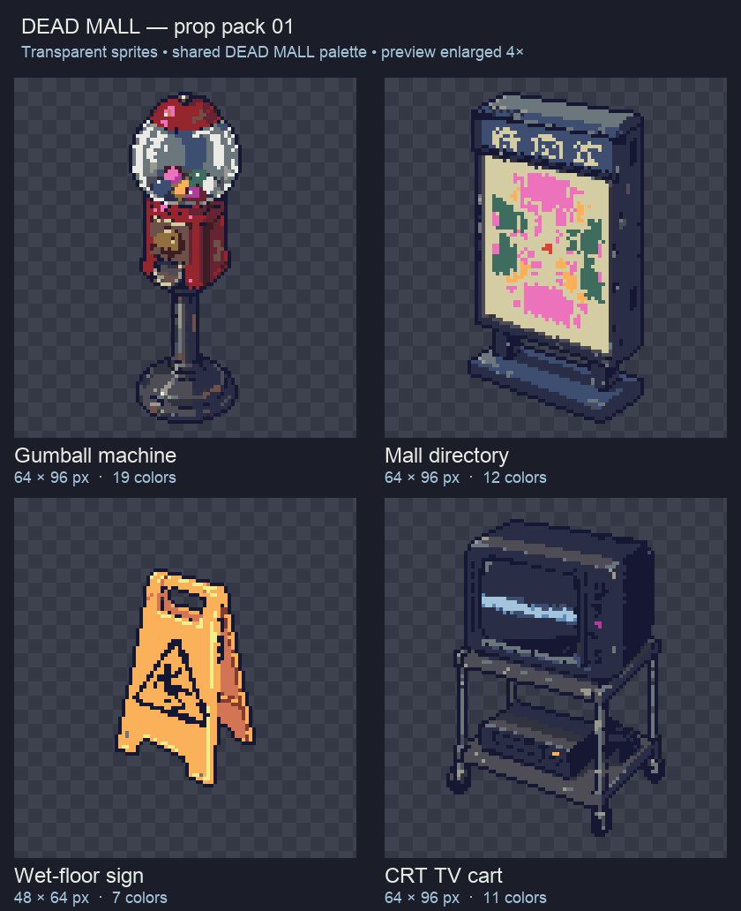
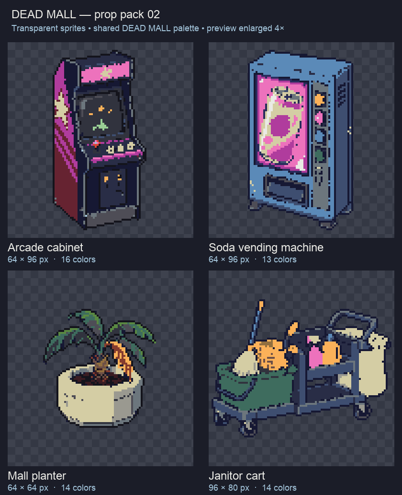

# DEAD MALL prop packs — 2026-09-30

Nine static prop candidates, with transparent native-size PNGs, compact variants, editable Aseprite masters, Pixel Forge JSON, and the source artwork. All assets are stored here for review and later game integration.

- [Detailed handoff and locations](HANDOFF.md)
- [Download pack 01](deadmall-props-01.zip): gumball machine, mall directory, wet-floor sign, CRT TV cart.
- [Download pack 02](deadmall-props-02.zip): arcade cabinet, soda vending machine, mall planter, janitor cart.
- [Payphone files](payphone/)

| Prop | Main PNG | Compact PNG | Editable master |
| --- | --- | --- | --- |
| Gumball machine | [64×96, 19 colors](pack-01/gumball-machine.png) | [32×48](pack-01/small/gumball-machine.png) | [Aseprite](pack-01/aseprite/gumball-machine.aseprite) |
| Mall directory | [64×96, 12 colors](pack-01/mall-directory.png) | [32×48](pack-01/small/mall-directory.png) | [Aseprite](pack-01/aseprite/mall-directory.aseprite) |
| Wet-floor sign | [48×64, 7 colors](pack-01/wet-floor-sign.png) | [24×32](pack-01/small/wet-floor-sign.png) | [Aseprite](pack-01/aseprite/wet-floor-sign.aseprite) |
| CRT TV cart | [64×96, 11 colors](pack-01/crt-tv-cart.png) | [32×48](pack-01/small/crt-tv-cart.png) | [Aseprite](pack-01/aseprite/crt-tv-cart.aseprite) |
| Arcade cabinet | [64×96, 16 colors](pack-02/arcade-cabinet.png) | [32×48](pack-02/small/arcade-cabinet.png) | [Aseprite](pack-02/aseprite/arcade-cabinet.aseprite) |
| Soda vending machine | [64×96, 13 colors](pack-02/soda-vending-machine.png) | [32×48](pack-02/small/soda-vending-machine.png) | [Aseprite](pack-02/aseprite/soda-vending-machine.aseprite) |
| Mall planter | [64×64, 14 colors](pack-02/mall-planter.png) | [32×32](pack-02/small/mall-planter.png) | [Aseprite](pack-02/aseprite/mall-planter.aseprite) |
| Janitor cart | [96×80, 14 colors](pack-02/janitor-cart.png) | [48×40](pack-02/small/janitor-cart.png) | [Aseprite](pack-02/aseprite/janitor-cart.aseprite) |
| Payphone | [64×128, 16 colors](payphone/payphone-64x128-palette.png) | [32×64](payphone/payphone-32x64.png) | [Aseprite](payphone/payphone-64x128.aseprite) |

The payphone Aseprite master matches the [original 32-color PNG](payphone/payphone-64x128.png). Its shared-palette variant is listed in the table.

## Previews

### Pack 01

### Pack 02

Use nearest-neighbor filtering and preserve aspect ratio. The scene scale, anchors, collision and in-game appearance still need review. These files do not change the running game.
